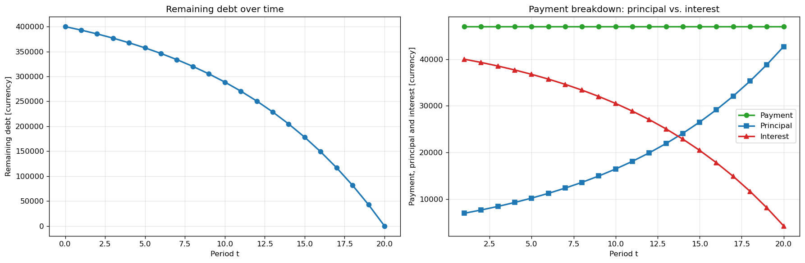

# Loan-Repayment-Calculator
Calculation of annuity payments, APR (Annual Percentage Rate) using the bisection method, and generation of an amortization schedule. The same model is available as an interactive Excel workbook and as a Python module.

## Features

- Computes the annuity payment for any repayment frequency (weekly to annual)
- Finds the APR by solving the present-value equation via bisection
- Handles both one-off and recurring fees at different frequencies
- Generates an amortization schedule and two charts (remaining debt, principal vs. interest split)

## Pyhon

### Use as a module

from loan_repayment_calculator import Loan

mortgage = Loan(
    loan_amount=4_000_000,
    num_payments=360,
    annual_interest_rate=0.054,
    payment_frequency="monthly",
    origination_fee=4_000,
    recurring_fees={"monthly": 150},  # account maintenance fee
)

print("-" * 60)
print("Input")
print(f"Loan amount:              {mortgage.loan_amount:>15,.2f} currency")
print(f"Number of payments:       {mortgage.num_payments:>15d}")
print(f"Nominal interest rate:    {mortgage.annual_interest_rate:>15.2%} p.a.")
print(f"Payment frequency:        {mortgage.payment_frequency:>15s}")
apr_value, iterations = mortgage.apr()
print("-" * 60)
print("Output")
print(f"Payment (no fees):        {mortgage.annuity_payment():>15,.4f} currency")
print(f"APR:                      {apr_value:>15.6%}")

Supported payment_frequency values: weekly, monthly, quarterly,
semiannual, annual.

## Excel
The workbook "loan calculator.xlsx" contains four sheets:
* APR and payment - Input fields are in the orange table in cells E4 to E21, H13 and H14. Everything else recalculates automatically. 
* Remaining debt per period
* Remaining debt - chart
* Payment breakdown - chart

### How it works
For an amortizing loan with equal monthly payments **A**, the payment amount is calculated as 

$$
A = S \cdot \frac{r(1+r)^n}{(1+r)^n-1}
$$

where  **S** borrowed amount, **n** is total number of payments, **r** is interest rate per payment period.**r** is calculatzed as r = i / p , where **i** is annual interest rate (decimal form, e.g. 5% = 0.05), **p** is number of payments per year.

---
The APR is the rate **x** at which the present value of what the borrower
receives equals the amount they pay

$$
S = \sum_{k = 1}^{n} \left(A + F_k\right)\ (1+x)^{-k}
$$

where **F** is fee. This equation has no closed-form solution, so bisection is used for rate **x** on the
interval [10⁻¹⁰, 10].

## Requirements for opening one or both files
- Python 3.10+ (uses dict[str, float] and tuple[…] type hints) with pandas, matplotlib 
- LibreOffice / Excel to open .xlsx

